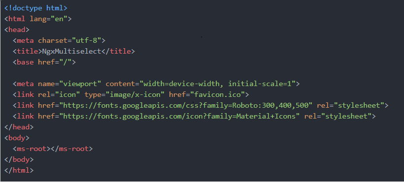
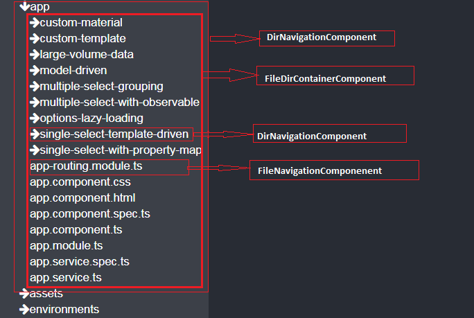

A code viewer designed exclusively to read code from github repo as in visual studio code built in angular based wholely on component architecture

#### Live Demo : https://nitinkalenk.github.io/githubAngular/

#### Working Example : 

#### Component Architecture :  
Basically there are two basic components you can see from the above demo or example  
        1) Navigation Component :- component to display tree view of files and directory on left hand side  
        2) Code View Component :- component to display the content of file clicked on right hand side  
First we will discuss about code view component
##### CodeViewComponent(code-view.component.ts) :-
  Its a simple component which recieves file data and on the basis of data and github api, it will fetch the contents of file and is also responsible to prettify the code according to programing language  
What about NavigationComponent?.  
##### Navigation Component :-  
Basically, navigation component will contain files and folders related to repository but the problem is a particular folder can also contain files in it as well as folders which again may have files and folders...  
        To solve this problem first I have created a   FileNavigationComponent(filenavigation.component.ts)  
        
        to display file entry and  
        DirnavigationComponent(dirnavigation.component.ts)  
          
        to display directory entry (with arrow to denote whether the directory is expanded or not).  
        and here is the crux of solution, I have developed one another component FileDirContainerComponent  
          
        which will act as parent for file and directory components.So in this case initially, FileDirContainerComponent will be rendered which contains files and directory component and on click of any directory, directory component will then contain another FileDirContainerComponent as a child which again may contain file and directory component related to clicked directory.....  
          
